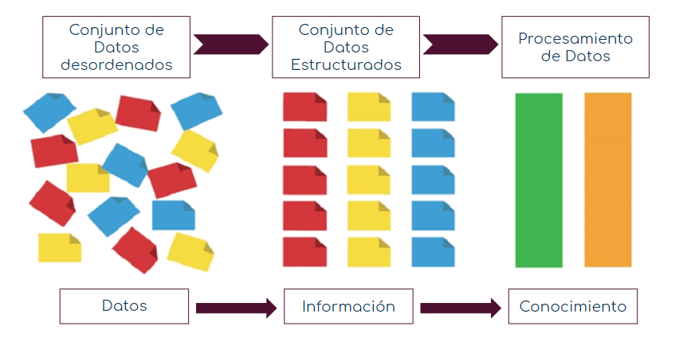

\centering 
CEPIES
 
Autor
Pais Año
\raggedright 
\clearpage 
\tableofcontents 

```{r setup, include=FALSE}
knitr::opts_chunk$set(echo = TRUE)

```

## Justificación del tema

El análisis de los datos es esencial en cualquier área de las ciencias existentes debido a que en nuestra vida cotidiana se van generando diferentes tipos de datos e información, es por eso que es necesario tener un conocimiento eficaz para poder interpretar y analizar los datos. Cualquier tipo de información bien analizado puede generar decisiones y/o estratégias óptimas para solucionar determinados problemas o cuestionantes.

##Contexto de la clase

###Lugar
Centro Psicopedagógico y de Investigación en Educación Superior "CEPIES" ubicado en la avenida 16 de Julio Edificio Avenida Nro. 1490, piso 2 La Paz, Bolivia.

###Público Objetivo
Estudiantes del paralelo "E" del Diplomado en Educación Superior en el módulo de Didáctica Universitaria.

###Características del público
Es un grupo muy heterogéneo en su formación profesional debido a que existen abogados, auditores, ingenieros, psicologos, estadísticos y otros lo cual hace interesante el avance de la materia debido a las diversos enfoques y opinioes que tienen. 

Esta compuesto por xx hombres y xx mujeres.

##Planificación de la clase
###Tiempo de duración
Diez (10) minutos cronometrádos.

### Introducción

### Desarrollo
####¿Existe diferencia entre dato e información?
**a) Definición de Dato.**

**Real Academia Española:** Del latín *datum* que significa *lo que se da*. Información sobre algo concreto que permite su conocimiento exacto o sirve para deducir las consecuencias derivadas de un hecho. <https://dle.rae.es/dato>

**Propia**: Unidad mínima de información que no tiene ningún tipo de orden.

**b) Definición de Información.**

**Real Academia Española:** Del latín *informatio*, -\ōnis *concepto, explicación de una palabra*'*. Comunicación o adquisición de conocimientos que permiten ampliar o precisar los que se poseen sobre una materia determinada.<https://dle.rae.es/informaci%C3%B3n>

**Propia:** Conjunto de datos ordenados y/o estructurados.

 


### Cierre

##Didáctica
###Jusitificación de la didáctica
###Bocetos
###Recursos

##Conclusiones del módulo


This is an R Markdown document. Markdown is a simple formatting syntax for authoring HTML, PDF, and MS Word documents. For more details on using R Markdown see <http://rmarkdown.rstudio.com>.

When you click the **Knit** button a document will be generated that includes both content as well as the output of any embedded R code chunks within the document. You can embed an R code chunk like this:

```{r cars}
summary(cars)
```

## Including Plots

You can also embed plots, for example:

```{r pressure, echo=FALSE}
plot(pressure)
```

Note that the `echo = FALSE` parameter was added to the code chunk to prevent printing of the R code that generated the plot.
